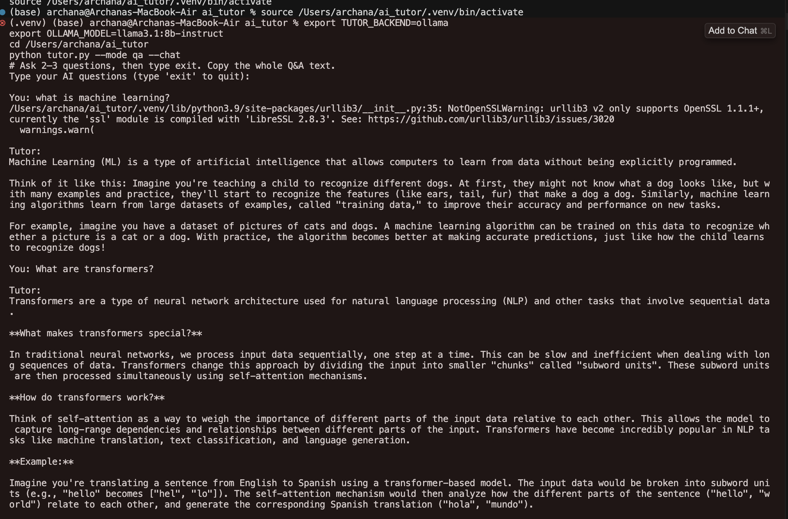

# AI Tutor 

<<<<<<< HEAD
A minimal CLI AI Tutor with simple prompts, API calls, and structured outputs. Uses OpenAI if `OPENAI_API_KEY` is set; otherwise can fall back to local Ollama.
=======
[](https://colab.research.google.com/github/archana-gurimitkala/ai-tutor/blob/main/colab_demo.ipynb)

A minimal CLI AI Tutor inspired by Week 1 principles: simple prompts, API calls, and structured outputs. Uses OpenAI if `OPENAI_API_KEY` is set; otherwise can fall back to local Ollama.
>>>>>>> acfb3fd (Prep assets folder + README updates)

## Quickstart

```bash
cd /Users/archana/ai_tutor
source .venv/bin/activate
pip install -r requirements.txt
cp .env.example .env  # edit as needed
python tutor.py --mode qa              # single AI question
python tutor.py --mode qa --chat       # open-ended AI Q&A chat
```

## Live Demo (No Terminal)
- Click the **"Open in Colab"** badge above to run the demo in your browser (no installation needed).
- Or open directly: [colab_demo.ipynb](https://colab.research.google.com/github/archana-gurimitkala/ai-tutor/blob/main/colab_demo.ipynb)

Colab steps:
- Run the first cell (installs dependencies)
- Enter your OpenAI API key when prompted
- Ask questions in the last cell; type `exit` to stop

### Colab Session Output Example


*To add your own screenshot/GIF:*
1. Run the Colab notebook and capture a screenshot/GIF of the Q&A session
2. Create an `assets/` folder: `mkdir assets`
3. Save it as `colab_demo_output.png` (or `.gif`) in the `assets/` folder
4. The image will appear above automatically

**Quick capture tips:**
- **Screenshot**: Use your OS screenshot tool or Colab's built-in capture
- **GIF**: Use tools like [Kap](https://getkap.co/) (Mac) or [ScreenToGif](https://www.screentogif.com/) (Windows/Linux)
- **Colab**: Run a sample Q&A, then screenshot the cells with outputs

## Sample Output

### OpenAI Example
```text
Type your AI questions (type 'exit' to quit):

You: What is overfitting in machine learning?

Tutor:
Overfitting happens when a model memorizes the training data—including noise—so it performs well on training but poorly on new data. It’s usually a sign the model is too complex for the amount/quality of data.

Example: A deep tree that perfectly classifies training points but fails on test data. Fixes include: more data, regularization, simpler models, cross‑validation, or early stopping.

You: exit
Goodbye!
```

### Ollama Example

```text

## Backends
The app auto-detects the backend. Set `TUTOR_BACKEND` to force one.

### Use with OpenAI
```bash
export TUTOR_BACKEND=openai
export OPENAI_API_KEY="YOUR_KEY"   # optional: export OPENAI_MODEL=gpt-4o-mini
python tutor.py --mode qa           # single
python tutor.py --mode qa --chat    # chat loop
```

### Use with Ollama (local)
```bash
# Ensure ollama is running and a model is available
ollama pull llama3.1:8b-instruct

export TUTOR_BACKEND=ollama
export OLLAMA_MODEL=llama3.1:8b-instruct   # optional: OLLAMA_HOST=http://localhost:11434
python tutor.py --mode qa
```

Notes:
- If `TUTOR_BACKEND` is not set: it uses OpenAI when `OPENAI_API_KEY` exists; otherwise Ollama.
- For remote Ollama, set `OLLAMA_HOST` to your server URL.

## Notes
- This CLI answers students' AI questions in plain language (single or chat mode).
- Keep sessions short and iterative.
